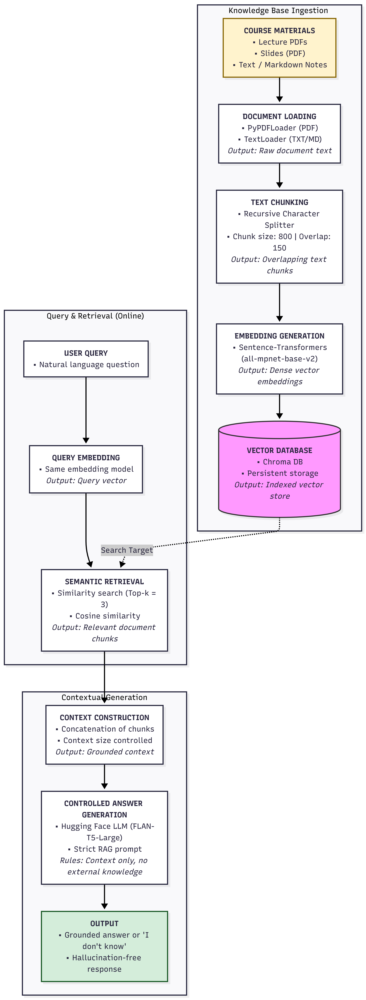

# RAG Course Chatbot

This project implements a **Retrieval-Augmented Generation (RAG)** application
that answers questions over university course materials (PDF and text files).

The system retrieves relevant document chunks and generates answers **strictly
from the retrieved context**, returning *"I don't know"* when the information
is not present.

---

## Architecture Overview

The application follows a vanilla RAG pipeline:

1. Document loading (PDF, TXT)
2. Text chunking with overlap
3. Semantic embedding using Sentence-Transformers
4. Vector storage with Chroma
5. Context-based answer generation using an open-source LLM

---

## RAG Pipeline Diagram

---

## Technologies Used

- LangChain
- Hugging Face Transformers
- Sentence-Transformers
- Chroma Vector Database
- Google Colab

---

## 📓 Notebook

The full implementation is available here:

---

##  Key Characteristics

- Open-source LLM (no GPT used)
- Retrieval-guided generation
- Hallucination prevention
- Academic / course-oriented use case

---

##  Academic Context

This project was developed as part of a university assignment
on Retrieval-Augmented Generation (RAG).

