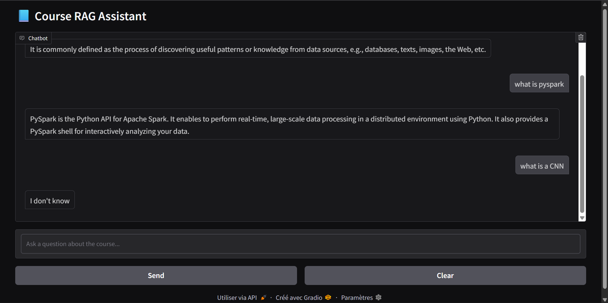

# RAG Course Chatbot

This project implements a **Retrieval-Augmented Generation (RAG)** application
designed to answer questions over **university course materials** (PDF and text files).

The system retrieves the most relevant document chunks and generates answers **strictly
from the retrieved context**, explicitly returning *"I don't know"* when the required
information is not present in the knowledge base.

## Author & Affiliation
**Realized by:**  
**Kenza EL MAKHCHOUNI**  
Master’s student in **Big Data and Smart Systems**  
**Sidi Mohamed Ben Abdellah University (USMBA)**, Morocco

---

## Architecture Overview

The application follows a standard **vanilla RAG pipeline** composed of the following steps:

1. Document loading (PDF, TXT)
2. Text chunking with overlap to preserve context
3. Semantic embedding using Sentence-Transformers
4. Vector storage and similarity search with Chroma
5. Context-aware answer generation using an open-source Large Language Model (LLM)

---

## ChatBot DEMO

---

## Technologies Used

- LangChain
- Hugging Face Transformers
- Sentence-Transformers
- Chroma Vector Database
- Google Colab

---

## Key Characteristics

- Fully open-source pipeline (no proprietary LLMs used)
- Retrieval-guided answer generation
- Explicit hallucination prevention strategy
- Academic and course-oriented question answering

---

---

## Explanation Video

You can watch a walkthrough of the RAG Course Chatbot in this video:

[Watch the demo video](https://drive.google.com/drive/folders/1hRTmAQ0iRSrtjm3DJOqqmHtANm3C2H3e?usp=sharing)

---

## Notes
This project was developed for **educational and academic purposes**, focusing on reliable
knowledge-grounded generation for university-level content.
